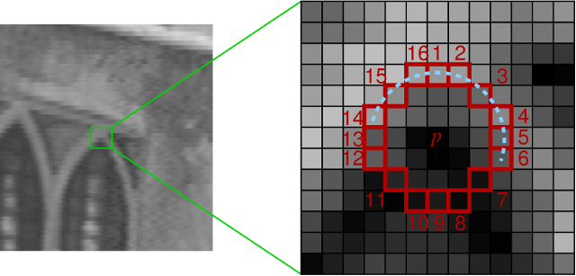

## FAST 角点原理

FAST的全称为 Features From Accelerated Segment Test 。是由 Edward Rosten 和 Tom Drummond 在 2006 年发表的  Machine learning for high-speed corner detection [^1]  文章中提出。FAST 角点定义为：若某像素点与周围邻域足够多的像素点处于不同区域，则该像素可能为角点。考虑灰度图像，即若某像素点的灰度值比周围邻域足够多的像素点的灰度值大或小，则该点可能为角点。与其他特征点相比较而言，FAST 在进行角点检测时，计算速度更快，实时性更好。

## 算法步骤

- 从图像中选取一个像素 $p$ ，其灰度值为 $I_p$ 

- 设定一个合适的阈值 $t$ 

- 以该像素点为中心考虑一个半径为 3 的离散化的 [Bresenham](https://en.wikipedia.org/wiki/Bresenham%27s_line_algorithm) 圆，圆边界上有 16 个像素（如下图所示）

    

- 如果圆上有 $n$ 个连续像素点的灰度值小于 $I_p-t$ 或者大于 $I_p+t$ ，那么这个点即可判断为角点（ $n$ 的值可取12 或 9）

一种快速排除大部分非角点像素的高效的测试方法是先仅仅检查周围 1、5、9、13 四个位置的像素，如果位置 1 和 9 与中心像素 $p$ 点的灰度差小于给定阈值，则 $p$ 点不可能是角点，直接排除；否则进一步判断位置 5 和 13 与中心像素的灰度差。如果这四个像素中至少有 3 个像素与 $p$ 点的灰度差超过阈值，则再考察邻域圆上 16 个像素点与中心点的灰度差，如果有连续至少 9 个超过给定阈值的像素则认为 $p$ 是角点。

## 角点分类器

- 选取需要检测的场景的多张图像进行 FAST 角点检测，选取合适的阈值 $n(n<12)$ ，提取多个特征点作为训练数据

- 对于图像上的点 $p$ ,它周围邻域圆上位置为 $x, \; x \in \{1, \dotsc, 16\}$ 的点表示为 $p \to x$ ，可以用下面的判断公式将该点 $p \to x$ 分为 3 类
  
    $$
  S_{p \to s} = 
  	\begin{cases}
  		d, & I_{p \to x} < I_p - t & (darker) \\
  		s, & I_p -t \leq I_{p \to x} \leq I_p + t & (similar) \\
  		b, & I_p + t < I_{p \to x} &(brighter)
  	\end{cases}
  $$
  
- 设 $P$ 为训练图像集中所有像素点的集合，我们任意 16 个位置中的一个位置 $x$ ，可以把集合 $P$ 分为三个部分 $P_d$ 、 $P_s$ 和 $P_b$ ，其中 $P_d$ 的定义如下， $P_s$ 和 $P_b$ 的定义与其类似
  
    $$
    P_b = \{ p \in P : S_{p \to s} = b \}
    $$
    
    换句话说，对于任意给定的位置 $x$ ，它都可以把所有图像中的点分为三类，第一类 $P_d$ 包括了所有位置 $x$ 处的像素在阈值 $t$ 下暗于中心像素，第二类 $P_s$ 包括了所有位置 $x$ 处的像素在阈值 $t$ 下近似于中心像素， $P_b$ 包括了所有位置 $x$ 处的像素在阈值 $t$ 下亮于中心像素

- 对每个特征点定义一个 bool 变量 $K_p$ ，如果 $p$ 是一个角点，则 $K_p$ 为真，否则为假

- 对提取的特征点集进行训练，使用 $\mathrm{ID}_3$ 算法建立一颗决策树，通过第 $x$ 个像素点进行决策树的划分，对集合 $P$ ，得到熵值为
  
    $$
    H(P) = (c+\hat{c}) \log_2(c+\hat{c}) - c \log_2 c - \hat{c} \log_2 \hat{c}
    $$
    
    其中 $c$ 为角点的数目， $\hat{x}$ 为非角点的数目。由此得到的信息增益为
    
    $$
    \Delta H = H(P)-H(P_d)-H(P_s)-H(P_b)
    $$
    
    选择信息增益最大位置进行划分，得到决策树

- 使用决策树对类似场景进行特征点的检测与分类

## 非极大值抑制

对于邻近位置存在多个特征点的情况，需要进一步做非极大值抑制 (Non-Maximal Suppression) 。给每个已经检测到的角点一个量化的值 $V$ ，然后比较相邻角点的 $V$ 值，保留局部邻域内 $V$ 值最大的点。 $V$ 值可定义为特征点与邻域 16 个像素点灰度绝对差值的和，即

$$
V = \max \left( \sum_{x \in S_{bright}} \left| I_{p\to x} - I_p \right| - t \;,\; \sum_{x \in S_{dark}} \left| I_{p\to x} - I_p \right| - t \right)
$$

上式中， $S_{bright}$ 是 16 个邻域像素点中灰度值大于 $I_p + t$ 的像素点的集合，而 $S_{dark}$ 表示的是那些灰度值小于$I_p - t$ 的像素点。

## 算法特点

- FAST 算法比其他大多数角点检测算法要快
- 受图像噪声以及设定阈值影响大
- 当设置 $n<12$ 时，不能用快速方法过滤非角点
- 检测出来的角点不是最优的，因为它的效率取决于问题的排序与角点的分布
- 多个特征点容易挤在一起
- FAST 不产生多尺度特征，而且没有方向信息不具备旋转不变性

## 参考

[^1]: [FAST Corner Detection -- Edward Rosten](http://www.edwardrosten.com/work/fast.html) 

[^2]: [思维之际博客](https://www.cnblogs.com/ronny/p/4078710.html)

--8<--
mathjax.txt
--8<--