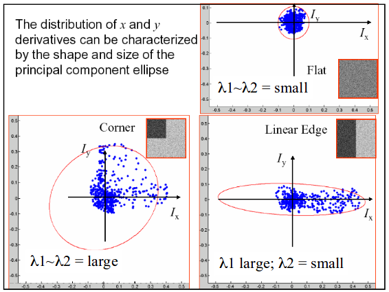

## 特征检测

**特征检测 (Feature detection)** 也称为**角点检测 (Corner detection)**，特征检测和匹配是许多计算机视觉应用中的一个重要组成部分，广泛应用于运动检测。图像匹配、视频跟踪、三维建模以及目标识别领域中。在 SLAM 前端，往往需要通过**特征跟踪 (Feature tracking)** 来先初步恢复相机的位姿。那么一张图向中的哪些特征是适合用来做匹配跟踪呢？通常拥有交大对比尺度（梯度）的图像块是比较容易定位的，又由于单一方向的直线段存在 “孔径问题 (aperture problem)” ，因而拥有至少两个（明显）不同方向梯度的图像块最容易定位。如下图所示：

从上图可以看出，不同图像块的孔径问题： (a) “角点” -- 稳定的，各方面都发生了重大变化； (b) “边 (edge)” -- 经典的孔径问题，沿边缘方向没有变化； (c) “平坦/无纹理的区域 (flat region)” -- 各方向都没有变化。从上面的描述我们认为通过移动一个小窗口会导致窗口中图像灰度变化剧烈，那么这个窗口中易于识别的特征是我们认为的角点。

### Harris 角点

#### 基本原理

特征点在图像中一般有具体的坐标，并具有某些数学特征，如局部最大或最小灰度、以及某些梯度特征等。这些直觉可以这样来形式化：用最简单的图像块匹配策略来比较两个图像块，通过它们的（加权）差的平方和：

$$
E_{\mathrm{wssd}}(\mathbf{u}) = \sum_i \omega(\mathbf{x}_i)[I_1(\mathbf{x}_i+\mathbf{u}) - I_0(\mathbf{x}_i)]^2
$$

其中 $I_0$ 和 $I_1$ 是两幅需要比较的图像块，$\mathbf{u} = (u, v)$ 是平移向量， $\omega(\mathbf{x})$ 是在空间上变化的权重（或窗口）函数，求和变量 $i$ 作用于块中的全体图像像素。由于在进行特征检测时，并不知道该特征被匹配时会终止于哪些相对的其他图像位置的匹配。因此，只能在一个小的位置变化区域 $\Delta \mathbf{u}$ 内，通过于原图像块进行比较来计算这个匹配结果的稳定度，这就是通常所说的**自相关函数 (autocorrelation function)** 。

根据上述，对于给定图像 $I(x, y)$ 和固定尺寸的邻域窗口，计算窗口平移前后各个像素差值的平方和，即在点 $(x, y)$ 处平移 $(\Delta x, \Delta y)$ 后的自相关性：

$$
E_{AC}(x,y;\Delta x,\Delta y) = \sum_{(u,v)\in W(x,y)} \omega(u,v)[I(u+\Delta x, v+\Delta y) - I(u,v)]^2
$$

其中，$W(x,y)$ 是以点 $(x, y)$ 为中心的窗口，$\omega(x,y)$ 是窗口加权函数，它可取均值函数或者高斯函数，如下图所示：

根据泰勒展开，可得到窗口平移后图像的一阶近似：

$$
\begin{align*}
I(u+\Delta x, v+\Delta y) &= I(u,v) + I_x(u,v)\Delta x + I_y(u,v)\Delta y + O(\Delta x^2,\Delta y^2) \\
						& \approx I(u,v) + I_x(u,v)\Delta x + I_y(u,v)\Delta y
\end{align*}
$$

其中，$I_x , I_y$ 是图像 $I(x,y)$ 的偏导数，那么自相关函数可以简化为：

$$
\begin{align*}
E_{AC}(x,y;\Delta x,\Delta y) &\approx \sum_{(u,v)\in W(x,y)} \omega(u,v)[I_x(u,v)\Delta x + I_y(u,v)\Delta y]^2 \\
& = \begin{bmatrix} \Delta x & \Delta y \end{bmatrix} M(x,y) \begin{bmatrix} \Delta x \\ \Delta y \end{bmatrix}
\end{align*}
$$

其中，

$$
\begin{align*}
M(x,y) &= \sum_W \begin{bmatrix} I_x(x,y)^2 & I_x(x,y) I_y(x,y) \\ I_x(x,y)I_y(x,y) & I_y(x,y)^2 \end{bmatrix} \\
&= \begin{bmatrix} \sum_W I_x(x,y)^2 & \sum_W I_x(x,y) I_y(x,y) \\ \sum_W I_x(x,y)I_y(x,y) & \sum_W I_y(x,y)^2 \end{bmatrix} \\
&= \begin{bmatrix} A & C \\ B & C \end{bmatrix}
\end{align*}
$$

也就是说图像 $I(x,y)$ 在点 $(x, y)$ 处平移 $(\Delta x, \Delta y)$ 后的自相关函数可以近似为二项函数:

$$
E_{AC}(x,y;\Delta x,\Delta y) \approx A\Delta x^2 + 2C\Delta x \Delta y + B\Delta y^2
$$

其中有 $A = \sum_W I_x^2 \; , \; B=\sum_W I_y^2 \; , \; C=\sum_W I_x I_y$ 。

二次项函数本质上是一个椭圆函数，椭圆的曲率和尺寸可由 $M(x,y)$ 的特征值 $λ1, λ2$ 决定，椭圆方向由 $M(x,y)$ 的特征向量决定，椭圆方程和其图形分别如下所示：

$$
\begin{bmatrix} \Delta x & \Delta y \end{bmatrix} M(x,y) \begin{bmatrix} \Delta x \\ \Delta y \end{bmatrix} = 1
$$

将梯度向量视为一组 $(dx，dy)$点，其质心定义为 $(0,0)$ 。通过散射矩阵 $M(x,y)$ 对该组点进行椭圆分析，根据不同情况分析椭圆参数。而 $x$ 和 $y$ 的分布可以通过是椭圆形状和大小主成分的特征，如下图所示：

https://senitco.github.io/2017/06/18/image-feature-harris/

https://www.cnblogs.com/ronny/p/4009425.html

