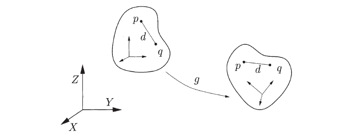
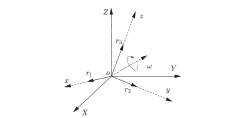

## 三维重建的起源

从一组二维视图重建世界的三维结构在计算机视觉领域有着悠久的历史。这是一个经典的*不适定问题 (ill-posed problem)*，因为重构一组一致的观察或图像相通常并不是唯一的。因此，我们需要附加一些假设。在数学上，研究三维场景与观测到的二维投影之间的几何关系是基于两种类型的变换，即，

- 用**欧几里得运动 (Euclidean motion)** 或**刚体运动 (rigid-body motion)** 来表示相机从当前帧到下一帧图像的运动
- 用**透视投影 (Perspective projection)** 来表示图像的形成过程 (如：**针孔相机 (pinhole camera)** 等)。

透视投影的概念起源于古希腊 (Euclid of Alexandria,  400 B.C.) 和文艺复兴时期 (Brunelleschi & Alberti, 1435)。透视投影的研究引出了**投影几何 (projective geometry)** 领域。

关于多视几何的第一个研究工作成果是来至于 Erwin Kruppa (1913) ，他指出五个点的两个视图足以确定两个视图之间的相对变换（运动） 和点的三维位置（结构）。Longuet-Higgins 在 1981 年提出了一种基于两视图**对极约束 (epipolar constraint)** 恢复运动结构重建的线性算法。在几本教科书中总结了一系列关于这方面的著作 (Faugeras 1993, Kanatani 1993, Maybank 1993, Weng et al. 1993) 。对三个视图的扩展由 Spetsakis 和 Aloimonos 87、90、Shashua 94 和 Hartley 95 研究发布的。多视图和正交投影的因子分解技术是由 Tomasi 和 Kanade 于 1992 年研究发布的。

相机运动与三维位置的联合估计称为**运动结构重建 (structure and motion)** 或**视觉 SLAM (visual SLAM)** 。

## 三维欧式空间

一般来说，欧几里得空间是一个集合，它的元素满足欧几里得的五个公理。三维的欧几里得空间 $\mathbb{E}^3$ 是由以下式为坐标的所有点 $P \in \mathbb{E}^3$ 组成的。

$$
\mathbf{X} \doteq [X_1, X_2, X_3]^\top = 
\begin{bmatrix} X_1 \\ X_2 \\ X_3 \end{bmatrix} \in \mathbb{R}^3
$$

通过这样一个**笛卡尔 (Cartesian) 坐标系**的赋值，可以在 $\mathbb{E}^3$ 和 $\mathbb{R}^3$ 之间建立一一对应关系。这里的 $\mathbb{E}^3$ 可以被视为等同于 $\mathbb{R}^3$ 。这意味着允许我们当讨论一个点 ( $\mathbb{E}^3$ ) 和坐标 ( $\mathbb{R}^3$ ) 犹如是一回事一样。笛卡尔坐标是使测量距离和角度成为可能的第一步。为此，必须为 $\mathbb{E}^3$ 赋予**度量标准 (metric)** 。 度量的精确定义依赖于向量的概念。

### 向量

在欧式空间中，一个向量 $\mathbf{v}$ 由一对点 $q, p \in \mathbb{E}^3$ 确定，被定义为链接 $p$ 到 $q$ 的有向箭头记号，表示称 $\mathbf{v} = \overrightarrow{pq}$ 。这里的点 $p$ 通常被称为是向量 $\mathbf{v}$ 的基点。假使点 $p$ 的坐标为 $\mathbf{X}$ ，点 $q$ 的坐标为 $\mathbf{Y}$ ，那么向量 $\mathbf{v}$ 的坐标为：

$$
\mathbf{v} = [v_1, v_2, v_3]^\top \doteq \mathbf{Y} - \mathbf{X} \in \mathbb{R}^3
$$

以上对向量的定位被称为**有界向量 (bound vector)** 。考虑这个向量独立于它的基点 $p$ 使得它是一个**自由向量 (free vector)** 。

!!! note ""  
    需要注意：点和向量是不同的几何对象。这一点很重要，我们很快就会看到，因为刚体运动对点和向量的作用是不同的。

所有自由向量 $\mathbf{v} \in \mathbb{R}^3$ 的集合构成一个线性向量空间。通过确定 $\mathbb{E}^3$ 和 $\mathbb{R}^3$ 之间的联系， $\mathbb{E}^3$ 的欧几里德度量标准仅由向量空间 $\mathbb{R}^3$ 上的一个**内积 (inner product，或称为点积，dot product)** 定义。有了这样一个度量标准 (metric) ，我们不仅可以测量点之间的距离（向量的模）或向量之间的角度，还可以计算曲线的长度或区域的体积。

运动粒子 $p$ 在 $\mathbb{E}^3$ 中的运动轨迹可用曲线 $\gamma(\cdot) : t \mapsto \mathbf{X} \in \mathbb{R}^3, t \in [0, 1]$ 来描述，则曲线的总长度为：

$$
l(\gamma(\cdot)) = \int_0^1 \| \dot{\mathbf{X}} (t) dt \|
$$

这里的 $\dot{\mathbf{X}} (t) = \frac{\mathrm d}{\mathrm d t} \big( \mathbf{X} (t) \big) \in \mathbb{R}^3$ 被称为曲线的切向量。 

### 叉积

在向量空间 $\mathbb{R}^3$ 上可以定义一个叉积运算，运算形式如下：

$$
\times : \mathbb{R}^3 \times \mathbb{R}^3 \to \mathbb{R}^3: \quad \mathbf{u} \times \mathbf{v} = \begin{bmatrix} u_2 v_3 - u_3 v_2  \\ u_3 v_1 - u_1 v_3 \\ u_1 v_2 - u_2 v_1 \end{bmatrix} \in \mathbb{R}^3
$$

其中，向量 $\mathbf{u, v}$ 的叉积结果是一个垂直于它们的向量。由于 $\mathbf{u} \times \mathbf{v} = - \mathbf{v} \times \mathbf{u}$ ，两个向量的外积正交于它的每个因子，因子的顺序决定了叉积结果的*方向 (orientation)*。这个方向满足**右手法则 (Right-hand rule)** 。

### 反对称矩阵

固定 $\mathbf{u}$ 可以因此一个通过反对称矩阵定义的线性映射： $\mathbf{v} \to \mathbf{u} \times \mathbf{v}$ ，该反对称矩阵表示成 $\hat{\mathbf{u}} \in \mathbb{R}^{3\times3}$ ，称为 “$\mathbf{u}$ **hat**” 。在一些文献中，反对称矩阵 $\hat{\mathbf{u}}$ 也可以表示成 $\mathbf{u}_\times \, \text{或} \, [\mathbf{u}]_\times$ ：

$$
\hat{\mathbf{u}} \doteq
\begin{bmatrix}
  0 & -u_3 & u_2 \\ u_3 & 0 & -u_1 \\ -u_2 & u_1 & 0
\end{bmatrix}
\in \mathbb{R}^{3\times3}
$$

因此，我们可将叉积写成 $\mathbf{u} \times \mathbf{v} = \hat{\mathbf{u}} \mathbf{v}$ 。反对称矩阵有 $\hat{\mathbf{u}}^\top = -\hat{\mathbf{u}}$ 。

反之，每一个反对称矩阵 $M = -M^\top \in \mathbb{R}^{3\times3}$ 可以通过向量 $\mathbf{u} \in \mathbb{R}^3$ 来关联识别。**帽 (hat)** , $\wedge : \mathbb{R}^3 \to so(3); \; \mathbf{u} \to \hat{\mathbf{u}}$ 运算符定义了一个*同构 (isomorphism)* 在空间 $\mathbb{R}^3$ 和所有由 $3\times3$ 反对称矩阵构成的 $so(3)$ 的子空间。它的逆操作称为 **vee** 操作 $\vee : so(3) \to \mathbb{R}^3; \; \hat{\mathbf{u}} \to \hat{\mathbf{u}}^\vee = \mathbf{u}$ 。

## 刚体运动

刚体的运动保持刚体上任意一对点 $(p,q)$ 之间的距离恒为 $d$ 。如下图所示：

因此，如果 $\mathbf{X}(t)$ 和 $\mathbf{Y}(t)$ 是物体上任意两点 $p,q$ 的坐标，那么它们的距离是恒定的：

$$
\| \mathbf{X}(t) - \mathbf{Y}(t) \| \equiv 常数, \quad \forall t \in \mathbb{R} \tag{1}
$$

**刚体运动 (rigid-body motion)** (或 **刚体变换 (rigid-body transformation)** ) 是一组映射，描述刚体上每个点的坐标如何在满足上式条件下随时间变化。将该映射表示成：

$$
g_t : \mathbb{R}^3 \to \mathbb{R}^3; \quad \mathbf{X} \to g_t({\mathbf{X}}) \quad t \in [0, T]
$$

且需要维持向量的**模 (norm)** 与**叉积 (cross product)** 满足以下两个式子：

- $\|g_t (\mathrm{v})\| = \|\mathrm{v}\|, \; \forall \mathrm{v} \in \mathbb{R}^3$ 
- $g_t(\mathrm{u}) \times g_t(\mathrm{v}) = g_t(\mathrm{u} \times \mathrm{v}), \forall \mathrm{u}, \mathrm{v} \in \mathbb{R}^3$ 

所有这些运动或变换的集合用 $SE(3)$ 表示。刚体运动引起的映射或变换称为**特殊欧几里德变换 (special Euclidean transformation)** 。“特殊” 一词表示转换是保持方向的。

根据上面刚体运动的定义，内积可以依赖范数通过*极化恒等式 (polarization identity)* 来定义：

$$
\langle u,v \rangle = \frac{1}{4} (\|u+v\|^2 - \|u-v\|^2)
$$

因此我们也可以说刚体运动是一个保持内积和外积的映射，而且根据定义可知道刚体运动也保留了**三重积 (triple product)** ：

$$
\langle g_t(u), g_t(v)\times g_t(w) \rangle = \langle u,v\times w \rangle, \forall u,v,w \in \mathbb{R}^3
$$

由于三重积对应于由这三个向量张成的平行六面体的体积，刚体运动也保留了**体积 (volume)** 。

### 刚体旋转的表达

如下图所示，刚体的旋转可以看作绕固定点 $o$ 沿着轴 $\omega$ 旋转。设参考系坐标 $W$ (实线) 是固定的，而旋转刚体的坐标系 $C$ (虚线) 与刚体绑定在一起。

坐标系 $C$ 相对于坐标系 $W$ 的构型 (或 “方位”) 由三个标准正交向量 $\mathbf{r}_1 = g_*(\mathbf{e}_1), \mathbf{r}_2 = g_*(\mathbf{e}_2), \mathbf{r}_3 = g_*(\mathbf{e}_3) \in \mathbb{R}^3$ 相对于世界坐标系 $W$ 的坐标变换决定。这三个向量 $\mathbf{r}_1, \mathbf{r}_2, \mathbf{r}_3$ 分别是沿着坐标系 $C$ 的三个主轴 $x, y, z$ 的单位向量。因此旋转矩阵的构型可以通过一个 $3 \times 3$ 的矩阵进行定义：

$$
R_{wc} \doteq [\mathbf{r}_1, \mathbf{r}_2, \mathbf{r}_3] \quad \in \mathbb{R}^{3 \times 3}
$$

其中三个向量 $\mathbf{r}_1, \mathbf{r}_2, \mathbf{r}_3$ 按照顺序堆叠成矩阵的三列。由于向量 $\mathbf{r}_1, \mathbf{r}_2, \mathbf{r}_3$ 来自正交坐标系，因此有

$$
\mathbf{r}_i^\top \mathbf{r}_j = \delta_{ij} \doteq \begin{cases} 1, & i = j \\ 0, & i \neq j \end{cases} \quad \forall i,j \in [1,2,3]
$$

将此用矩阵形式表示为

$$
R_{wc}^\top R_{wc} = R_{wc}R_{wc}^\top = I
$$

任何满足上述恒等式的矩阵称为**正交矩阵 (orthogonal matrix)** ，根据上面的定义，正交矩阵的逆就是它的转置： $R_{wc}^{-1} = R_{wc}^\top$ 。由于 $\mathbf{r}_1, \mathbf{r}_2, \mathbf{r}_3$ 构成了一个右手坐标系，因而进一步得到了 $R_{wc}$ 的行列式必须为 $+1$ 的条件。因此矩阵 $R_{wc}$ 是**特殊正交阵 (special orthogonal matrix)** ，这里的特殊指示了该矩阵是正定的。所有 $\mathbb{R}^{3 \times 3}$ 的特殊正交阵构成的空间定义如下：

$$
SO(3) \doteq \{ R \in \mathbb{R}^{3 \times 3} | R^\top R = I, \det(R) = +1 \}
$$

#### 旋转的指数坐标

根据上述，我们可知在 $\mathbb{E}^3$ 空间中刚体运动的旋转可以通过一个 $3 \times 3$ 的旋转矩阵 $R \in SO(3)$ 表示。每一个旋转矩阵 $R$ 通过 $3 \times 3 = 9$ 元素定义。然而，这 $9$ 个元素并不是自由参数，因为它们必须满足 $R^\top R= I$ 的约束，这实际上对 $9$ 个元素施加了 $6$ 个独立的约束。因此，由旋转矩阵构成的空间 $SO(3)$ 的维度应该只有 $3$ 维，而 $9$ 参数中有 $6$ 实际上是多余的。

给定一个轨迹 $R(t) : \mathbb{R} \to SO(3)$ 描述一个连续的旋转运动，那么旋转必须满足下式：

$$
R(t) R^\top(t) = I
$$

计算上面方程对时间 $t$ 的导数，注意到右边是一个常数矩阵，可以得到

$$
\dot{R}(t) R^\top(t) + R(t) \dot{R}^\top(t) = 0 \quad \Rightarrow \quad \dot{R}(t) R^\top(t) = - (\dot{R}(t) R^\top(t))^\top
$$

根据性质，我们可知矩阵 $\dot{R}(t) R^\top(t) \in \mathbb{R}^{3 \times 3}$ 是一个反对称矩阵。 根据[反对称矩阵的性质](#反对称矩阵)，一定存在一个向量，设为 $\omega(t) \in \mathbb{R}^3$ ，使得

$$
\dot{R}(t) R^\top(t) = \hat{\omega}(t) \quad \Rightarrow \quad \dot{R}(t) = \hat{\omega}(t) R(t)
$$

根据上式，如果假设 $R(t_0) = I$ 且当 $t = t_0$ 时有 $\dot{R}(t_0) = \hat{\omega}(t_0)$ 。因此，围绕单位矩阵 $I$ ，偏对称矩阵给出了旋转矩阵的一阶近似

$$
R(t_0 + dt) \approx I + \hat{\omega}(t_0)dt
$$

综上可得，所有的斜对称矩阵张成的空间如下表示

$$
so(3) \doteq \{ \hat{\omega} \in \mathbb{R}^{3 \times 3} | \omega \in \mathbb{R}^3 \}
$$

它亦被称为旋转群 $SO(3)$ 在恒等点处的**切空间 (tangent space)** 。旋转群 $SO(3)$ 被称为**李群 (Lie group)** ，而它的切空间 $so(3)$ 被称为**李代数 (Lie algebra)** 。

#### 李群和李代数

李群 (或无穷小群) 是一个光滑的流形，也是一个群，因此群运算乘法和逆运算是光滑的映射。

李群与李代数涉及到庞大的知识量，这里对这部分就不进行拓展描述。后续或许会有专门的篇幅来记录这些知识点，再进行添加链接跳转（#TODO）。这部分知识我当时是阅读了[《机器人学中的状态估计》](http://asrl.utias.utoronto.ca/~tdb/) 中相关的篇幅来学习的。当然读者也可以阅读更加数学性的书籍来学习，这里就不在引申。

!!! tip "Sophus Lie (1841 - 1899)"
    马里乌斯·索菲斯·李 (Marius Sophus Lie) 是一位出生于挪威的数学家。他创立了连续对称理论，并将其应用于几何和微分方程的研究。他最大的成就之一是发现连续变换群在线性化的版本中更容易理解 (Theorie der transformation sgruppen 1893)。这些无限小的生成器构成了一个今天被称为李代数的结构。群律的线性化版本对应于李代数上的一个操作，称为换向器托架或李托架。

#### 指数映射

--8<--
mathjax.txt
--8<--