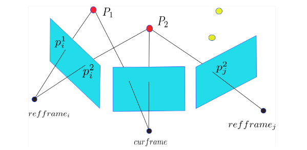

## SVO 运行实践

SVO 的下载编译可以参照 SVO 作者写的教程：https://github.com/uzh-rpg/rpg_svo/wiki 。如果手上没有摄像头的话，作者提供了数据集，可以参照文档先跑跑试试。

下面给出利用 [**MYNT-EYE(S)**](https://mynt-eye-s-sdk.readthedocs.io/zh_CN/latest/index.html) 摄像头运行 SVO 程序的简单实践过程。作者提供的数据集选用的是 ATAN 相机模型，然而 MYNT-EYE 选用 Pinhole 模型。利用 MYNT-EYE 官方提供的 SDK 运行摄像头，关于摄像头标定这部分这里就不展开。根据 live.launch 我们知道需要提供摄像头的 Mono 图像数据，以及该摄像头的标定参数。#TODO

## 初始化

在介绍初始化前，先简单介绍一下关于 `SVO_ROS` 的节点函数。当运行 `roslaunch` 调用 svo 之后，来到 `rpg_svo/svo_ros/ src/vo_node.cpp` 文件下运行 main 函数。

1. 初始化 `ROS` ，接着创建一个节点句柄和节点 `VoNode` ，在创建 `VoNode` 的构造函数中开辟了一个线程用于监听控制台输入，然后加载摄像头参数，并初始化可视化的初始位姿，最后创建视觉里程计，并完成一系列初始化操作
2. 订阅摄像头消息，每当获取到更新图像信息后回调 `svo::VoNode::imgCb` 函数，进入循环之后，接下来的所有工作都会在这个函数内完成
3. 订阅远程输入消息（应该指的就是键盘输入）

紧接着我们还是进入正题。在节点创建的过程中，程序创建了一个里程计算法入口 `svo::FrameHandlerMono` 类的变量 ，在整个构造函数运行过程中，以及并调用了 initialize 函数来完成一系列算法部件的初始化。其中有几个比较重要的过程：

- 进行重投影的初始化，由 `Reprojector` (定义在 `reprojector.cpp` 中) 构造函数以及 `initialize` 函数完成，`grid_` 为 `Grid` 类变量，`Grid` 中定义了 `CandidateGrid` 型变量 `cells` ，而 `CandidateGrid` 是一个 `Candidate` 型的list（双向链表）组成的 vector（向量）向量。`grid_.cells.resize` 是设置了 `cells` 的大小，即将图像划分成多少个格子。然后通过 `for_each` 函数对 `cells` 每个链表（即图像每个格子）申请一块内存。之后通过 `for` 函数给每个格子编号，最后调用 `random_shuffle` 函数将格子的编号顺序打乱。
- 特征检测初始化，创建一个 `FastDetector` 类变量，该类继承于 `AbstractDetector` 类，初始化特征检测格子大小及需要多少行多少列格子，设置特征提取的金字塔层数，和每个格子是否已经存在特征点的 `std::vector<bool> grid_occupancy_` 变量。
- 通过 `DepthFilter`（深度滤波器）构造函数完成初始化，设置了特征检测器指针、回调函数指针、线程、新关键帧深度的初值，并启动深度滤波器线程。其中这里的回调函数指针需要注意，它的本意为：`depth_filter_cb(_1, _2) => (&map_.point_candidates_)->newCandidatePoint(_1, _2)`

### 第一帧

图像是通过 `FrameHandlerMono::addImage` 函数加载进里程计算法中的。在每一新建 `Frame` 类指针变量时，对图像进行提取图像金字塔，默认 5 层、尺度因子为 2 。接着进入 `FrameHandlerMono::processFirstFrame` 函数处理第一帧图像。

1. 创建一个位姿变换矩阵赋给第一帧的 `T_f_w_` (表示从世界坐标到相机坐标的变换矩阵) 
2. 创建一个特征检测器，默认设置特征提取的金字塔为 0~3 层，栅格大小为 30 。调用特征检测函数提取当前帧中的 Fast 特征角点。为了适应多尺度变化，对图像金字塔的多层图像提取 Fast 角点，紧接通过小窗口做非最大值抑制。之后对同一层图像坐落在同一网格中的 Fast 角点求 shiTomasi 得分，取得分最高的强角点。（关于 Fast 角点，与 shiTomasi 角点/得分这部分知识可以参考 xxx计算机视觉基础-特征点提取xxx #TODO）
3. 判定特征数与门限值进行比较，如果特征点数少于门限值则下一帧图像重新进行以上操作，否则将提取的所有角点暂存储在向量容器中，用于后续做光流跟踪。并将该帧设置为关键帧，添加到地图中。

### 第二帧

这里的第二帧，实际上是指在能够与第一帧图像较好的进行三角化并计算出空间点和计算 Homography 矩阵并恢复位姿变换矩阵这段期间的所有帧图像都当作第二帧来处理。

1. 利用 LK 光流法跟踪第一帧提取的特征点。作者一直使用第一帧检测的特征点为基准，然后后面来的帧一直用第一帧的特征点做光流跟踪。个人感觉这种做法鲁棒性并不好， 应该改成当前帧和前一帧做光流跟踪，而不是一直只用第一帧跟踪，这样修改之后初始化鲁邦了很多，特别是在畸变较大的摄像头上。
2. 去掉跟踪丢失的特征点，并计算所有跟踪良好的关联角点的像素距离。如果跟踪点数少于阈值，则退出并返回 FAILURE 。否则，判定所有跟踪良好的关联角点的像素距离的中位数是否大于阈值，如果是，则进行下一步骤，否则返回非关键帧等待下一帧重复以上步骤。
3. 将第一帧和第二帧关联角点各自图像坐标系下的单位球坐标（图像坐标系下的三维空间单位向量）转换成单位平面坐标来计算 Homography 矩阵。作者利用 OpenCV 自带的 `cv::findHomography` 函数来计算单应矩阵，采用了**随机采样一致性 (RANSAC)**  方式，并设置重投影误差需要小于 2 个像素点。然后利用「 **Faugeras SVD-based decomposition** 」[^1] 方式恢复出两帧之间的变换矩阵。（关于单应矩阵的计算以及从单应矩阵求取变换矩阵的算法可参考 xxx多视几何-单应矩阵xxx  #TODO，我对这部分代码做了注解，可以参考 [`homography.cpp`](https://github.com/LSXiang/SVIO/blob/master/vikit_common/src/homography.cpp) ）
4. 利用上一步解算的变换矩阵计算特征点在当前帧坐标系下的 3D 位置坐标，以及分离出内点 (inlier) 与外点 (outlier) 并统计个数，其中利用了中点法三角化求解深度值（算法推导参考 [issue](https://github.com/uzh-rpg/rpg_svo/issues/62) ）。如果内点个数少于阈值，则返回错误，否则从这些内点的 3D 位置坐标提取深度信息，然后选着中位数作为均值，调节地图大小以使得地图平均深度等于指定比率。之后，计算当前帧与世界坐标系下变换矩阵，并根据地图深度尺寸比率重新计算当前帧与世界坐标系的位移量。最后为每一个内点创建世界坐标系下的 3D 坐标，并将这些关联世界坐标系的 3D 特征点的角点信息添加到第一帧和当前帧中。
5. 如果你选着了使用 G2O 则进行两帧之间的 Bundle Adjustment 。设置当前帧为关键帧，并计算当前帧中观察到的 3D 空间特征点到当前图像的深度均值和最小值。之后将当前帧添加到深度滤波器和地图中。

## 后续帧的里程估计

完成初始化过程之后，接下来就是针对更新的每一帧图像来计算里程了。而这一部分的所有算法过程可以参考「[SVO 算法架构](./algorithm_framework.md#svo-算法架构)」。

1. #### 稀疏直接法
    系数直接法设置是在 `Config::kltMaxLevel(), Config::kltMinLevel()` 这几层图像金字塔层之间迭代，默认值为 4 与 2 。如果摄像头原始图像的大小为 752×480 ，那么在默认情况下，那么直接法从第 4 层金字塔图像大小为 47×30 开始优化，优化得到一个结果作为初始值传给下个金字塔层进行直接法迭代优化位姿，最后结束迭代的第 2 层金字塔的分辨率是 188×120 。直接法应用了 4×4 的像素块进行对比求取残差，并利用高斯牛顿法进行迭代更新。程序统计直接法最终返回的是成功跟踪计算残差的特征点数。

    
    
2. #### 重投影

    重投影过程首先是获取地图中能够与当前帧存在共视的关键帧。共视的判断是通过投影关键帧中的 5 个关键特征点（位于图像中间和四个边角）到当前帧中，判断是这些关键特征点是否能够被当前帧所观察得到。如果存在共视，那么计算参考关键帧与当前帧之间的距离，然后按照距离从小到大排序，默认情况只从投影距离较小的 10 帧关键参考帧中的已经存在空间 3D 坐标的特征点到当前图像中，且通过记录空间点最后投影图像的 id (`point->last_projected_kf_id_`) 确保了同一个空间特征点只投影一次。

    > 这里引用 白巧克力亦唯心 (贺博) [博客](https://blog.csdn.net/heyijia0327/article/details/51649082)中关于地图点和关键帧上的图像特征点是如何联系的来捋顺下这部分的描述的。
    >
    >  
    >
    > 如下图所示，首先地图点 $P$ 存储的是他们在世界坐标系中三维坐标，因此，他们可以自由的投放到任意帧上去。另外，地图点记录了哪些帧上的特征点能够观测到它，比如，通过 $P_i^2 , P_j^2$ 能够找到地图点 $P_2$ ，反过来，地图点 $P_2$ 通过变量 `obs_` 记录了它和哪些特征是联系起来了，因此也知道图像中特征 $P_i^2 , P_j^2$ 能够观测到它。 
    >
    > 现在，回到关键帧重投影步骤，找到关键帧后，遍历关键帧上的特征点，通过特征点找到地图点，然后一一投影到当前帧。注意，一个地图 point 点只需要投一次，所以比如 $P_2$ 通过 $\text{refframe}_i$ 投影了一次，就不用通过 $\text{refframe}_j$ 再投一次了。

    投影完关键帧中的特征点之后，紧接着是把地图中没有插入到关键帧中的候选点 `point_candidates_` 也全部投影到当前帧中。最后针对重投影坐落于同一个 cell 中空间特征点按照质量（这里的质量是通过这些特征点被观察到的次数来衡量的）进行排序然后进行投影匹配操作。

    匹配操作首先是针对该空间投影点 `point` 挑选最好的匹配特征块，即，该为地图点 $P_2$ 筛选图像中特征 $P_i^2$ 还是 $P_j^2$ 来进行匹配。挑选的方法是根据该空间点投影到当前帧和参考帧之间的夹角大小来筛选的，挑选最小的投影夹角且该夹角要求小于 60 度。然后判断该空间点筛选处理的特征块是否符合要求。之后计算两帧之间的仿射变换。然后根据求解出来的仿射变换矩阵的行列式大小来判断特征快投影后位于当前帧中的合适尺寸大小，即位于哪一层金字塔上。接着，从参考帧中提取一块参考特征块用于与当前帧进行匹配。最后，通过[特征点对齐优化](algorithm_framework.md#通过特征点对齐优化匹配关系)当前帧特征点的位姿。

    如果特征点对齐优化失败，则累加该空间投影点 `point` 失败次数，如果次数超过阈值且状态不是 `TYPE_GOOD` 的话，则删除该空间点。反之，特征点对齐优化成功，则累加空间投影点 `point` 成功次数次数，如果次数超过阈值且状态为 `TYPE_UNKNOWN` 的话，则状态转变为 `TYPE_GOOD` 。最后为当前帧创建优化后的特征点，并添加到该帧中。

    进行完该步骤之后，判断重投影成功的空间点数，如果数量少于阈值的话，则进入重定位，否则继续一下步骤

    

3. #### BA 优化

    利用上一步重投影以后的特征点开始进行当前帧的位姿及结构优化。位姿优化用到了核函数 `TukeyWeightFunction` ，根据误差模型来调整误差权重，Tukey's hard re-descending function 可以参考[维基百科](http://en.wikipedia.org/wiki/Redescending_M-estimator)。位姿优化的时候，会根据投影误差丢掉一些误差大的特征点，最后留下来进行位姿优化的这些特征点被变量 `sfba_n_edges_final` 记录下来，利用它来判断跟踪质量好不好 `setTrackingQuality(sfba_n_edges_final)`  函数判断跟踪不好的依据是，用于位姿优化的点数 `sfba_n_edges_final` 小于一个阈值，或者比上一帧中用于优化的点减少了很多。

    优化地图点是现实寻找（默认为 20 个）空间点中最后一次优化较早的空间点，然后针对每一个空间点优化其三维位置，使得它在它被观察到的每个关键帧上的重投影误差最小。默认每个地图点优化 5 次。如果这次优化的误差平方和小于上次优化的误差平方和，就接受这次的优化结果。

## 深度估计与建图

跟踪上面所得到的结果，先获取当前帧图像中空间点的平均深度和最小深度。然后判读机制判读该帧是否是关键帧，如果不是，则添加到深度滤波器中用于更新优化关键帧中深度估计未收敛的特征点。如果判读为关键帧，那么先置位为关键帧标志位，并寻找关键空间点。然后为当前帧能观察到的空间点的 `obs_` 添加当前帧的特征点为关联关系。并将地图中能被当前帧观察到的已经收敛的空间候选点添加到第一次观察到它们的关键帧中。如果启动 bundle adjustment 则会进行一次关键帧的全局 BA 优化。当深度滤波器添加进去的帧是关键帧的话，那么将为该帧划分栅格，为栅格中还未有特征点的添加 Fast 特征，并利用后续帧对这些特征点进行深度估计。深度估计的整个过程算法可以参考上一篇算法分析中的[地图构建](algorithm_framework.md#地图构建)部分。

在把新关键帧添加到地图中的时候，先判断下地图中存储的关键帧是否已经超过阈值了，如果是则选着地图中与当前关键帧距离最远的关键帧进行删除。

## 重定位

SVO中重定位，实现很简单，就是在跟丢之后，仍然假设当前帧的位姿和前一帧一样，往这个位姿上投地图点，用「后续帧的里程估计 」部分中的方法去优化计算，如果优化成功，就重定位回来，如果优化不成功，就继续下一帧。所以，在跟丢后，只能再回到跟丢时的位置，才能重定位回来。

这样子实现重定位的方法很简单，可重定位的效果就很差了。这地方可以进行改进。 

## 总结

关于 SVO 跑自己摄像头老丢失特征并重定位的一些分析可以参考贺博的博客[^2] 。对于 SVO 中多处雅克比矩阵的推导可以参考极品巧克力的博客[^3] 。如果你需要更细致的代码注解那么可以参考冯兵的博客[^4] 。

[^1]: [Motion and structure from motion in a piecewise plannar environment](https://www.researchgate.net/publication/243764888_Motion_and_Structure_from_Motion_in_a_Piecewise_Planar_Environment)

[^2]: [SVO 代码笔记](https://blog.csdn.net/heyijia0327/article/details/51649082) 
[^3]: [SVO 详细解读](https://www.cnblogs.com/ilekoaiq/p/8659631.html) 
[^4]: [一步步完善视觉里程计 系列](http://fengbing.net) 

--8<--
mathjax.txt
--8<--