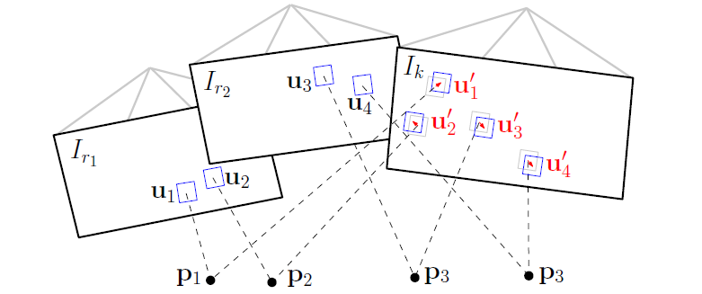

## SVO : Semi-Direct Visual Odometry

半直接视觉里程计，所谓的半直接是指对图像中提取的特征点图像块进行直接匹配来获取相机的位姿，而不同于直接匹配法那么对整个图像使用直接匹配的方式来获取相机位姿。虽然*半直接 (Semi-Direct)* 法使用了特征块，但它的基础思想还是类似于*直接法 (Direct method)* 来获取位姿信息，这点与*特征点法  (Feature-Based method)* 的提取额一组稀疏特征点，使用特征描述子匹配，通过对极约束来估计位姿是不一样的。然而，半直接法与直接法不同的是它利用了特征块匹配，通过再投影误差最小化来对直接法估计的位姿进行优化。

!!! tip  
    虽然 SVO 并不是一个标准的完整 SLAM ，它舍弃了后端优化与回环检查部分，也基本没有建图功能，但是 SVO 的代码结构清晰易于理解，很适合作为第一个入门项目。

## SVO 算法架构

SVO 算法架构主要分成两个部分：位姿估计、深度估计。如下图所示

运动估计线程部分实现了相对姿态估计的半直接法。步骤如下：  

1. 通过基于稀疏的图像对齐进行姿态初始化：通过最小化对应于相同 3D 点投影位置的像素之间的光度误差，得到相对于前一帧的相机姿态
2. 通过对相应的 feature-patch 进行对齐，对重新投影点对应的 2D 坐标进行优化
3. 通过最小化前向特征对准步骤中引入的重投影误差来精炼姿态和空间特征点位置以得到运动估计的结果

深度估计部分，为每个待估计相应 3D 点的 2D 特征初始化概率深度滤波器。每当在图像中发现此时的 3D 到 2D 的特征对应少于设定阈值的时候，将选择新的关键帧提取特征点，进而初始化新的深度滤波器。这些滤波器的初始值具有很大的不确定性，在随后的每一帧中，深度估计都以贝叶斯方式更新。当深度滤波器的不确定性足够小时（即收敛），在地图中插入一个新的三维点，并立即用于运动估计。

### 运动估计

SVO 利用直接方法对相机的相对运动和特征对应进行了初步的估计，并以基于特征的非线性重投影误差最小化方法进行了优化。下面将详细介绍其中的每个步骤。

#### 基于稀疏模型的图像对齐

基于稀疏模型的图像对齐 (Sparse Model-based Image Alignment) 使用直接法最小化图像块重投影残缺来获取位姿。如下图所示：其中{==红色==}的 $\color{red}{T_{k, k-1}}$ 为相邻帧之间的位姿变换，即待优化变量。

这个过程的数学表达为求一个关于刚体运动最大似然估计 $T_{k, k-1}$ ，即可以通过求在两个连续的相机姿态之间亮度残差的最小化负对数似然函数来得到：

$$
\begin{align}
\mathrm{T}_{k,k-1} = \mathrm{arg\, \mathop{min}\limits_T} \iint_{\bar{\mathcal{R}}} \mathrm{\rho} [\delta I(\mathrm{T}, \mathbf{u})] \mathrm{d} \mathbf{u}
\end{align}
$$

因此这个过程可以分解为：

- **准备工作：**假设相邻帧之间的位姿 $\mathrm{T}_{k, k-1}$ 已知，一般初始化为上一相邻时刻的位姿或者假设为单位矩阵。通过之前多帧之间的特征检测以及深度估计，我们已经知道在第 k-1 帧中的特征点位置 $\mathbf{u}$ 以及它们的深度 $\mathrm{d}_\mathbf{u}$ 。 

- **重投影：**亮度残差 $\delta I$ 由观测同一个三维空间点的像素间的光度差确定。准备工作中已知了 $I_{k-1}$ 中的某个特征在图像平面中位置 $\mathbf{u}$ 以及它们的深度 $\mathrm{d}_\mathbf{u}$ ，能够将该特征投影到三维空间 $\mathrm{p}_{k-1}$ 。由于该三维空间的坐标系是定义在 $I_{k-1}$ 相机坐标系下的，因此需要通过位姿变换 $T_{k, k-1}$ 将它投影到当前帧 $I_{k}$ 中，得到该点当前帧坐标系中的三维坐标 $\mathrm{p}_{k}$ 。最后通过相机内参，投影到 $I_{k}$ 的图像平面得到坐标 $\mathbf{u}'$ ，完成重投影。亮度残差 $\delta I$ 定义为：

    $$
\begin{align}
\delta I (\mathrm{T}, \mathbf{u}) = I_k \Big( \underbrace{ \pi \big( \underbrace{ \mathrm{T} \cdot \underbrace{\pi^{-1}(\mathbf{u}, \mathrm{d}_\mathbf{u}) \big)}_{1}}_2 }_3 \Big) - I_{k-1}(\mathbf{u}) \quad \forall \mathbf{u} \in \bar{\mathcal{R}}
\end{align}
    $$

    公式中第 1 步为根据前一帧图像特征位置和深度逆投影到三维空间，第 2 步将三维坐标点旋转平移到当前帧坐标系下，第 3 步再将三维坐标点投影回当前帧图像坐标。其中上一帧 $I_{k-1}$ 和当前帧  $I_{k}$ 能共视到的特征集合为 $\bar{\mathcal{R}}$ ，即
    
    $$
\begin{align}
\bar{\mathcal{R}} = \{ \mathbf{u} | \mathbf{u} \in \mathcal{R}_{k-1} \wedge \pi (\mathrm{T} \cdot \pi^{-1}(\mathbf{u}, \mathrm{d}_\mathbf{u})) \in \Omega_k \}
\end{align}
    $$

    当然在优化过程中，亮度残差 $\delta I$ 的计算方式不止这一种形式：有**前向 (forwards)** ，**逆向 (inverse)** 之分，并且还有**叠加式 (additive)** 和**构造式 (compositional)** 之分。这方面可以读读光流法方面的论文 [^2]。选择的方式不同，在迭代优化过程中计算雅克比矩阵的时候就有差别，一般为了减小计算量，都采用的是 **inverse compositional algorithm** 。 (#TODO 抑或是参考计算机视觉基础-光流篇) 

- **迭代优化更新位姿：**按理来说极短时间内的相邻两帧拍到空间中同一个点的亮度值应该没啥变化。但由于位姿是假设的一个值，所以重投影的点不准确，导致投影前后的亮度值是不相等的。不断优化位姿使得这些以特征点为中心的 $4 \times 4$ 像素块残差最小，就能得到优化后的位姿 $\mathrm{T}_{k, k-1}$ 。

将上述过程公式化如下：为简便起见，我们假设亮度残差服从单位方差正态分布，那么负对数最小化似然估计等同于最小二乘问题，即 $\rho[\cdot] \hat{=} \frac{1}{2} \|\cdot \| ^2$ 。因此位姿 $T_{k, k-1}$ 的最小化残差**损失函数 (Cost Function)** 为：

$$
\begin{align}
\mathrm{T}_{k,k-1} = \arg  \min_\limits{\mathrm{T}_{k,k-1}} \frac{1}{2} \sum_{i \in \bar{\mathcal{R}}} \| \delta \mathrm{I}(\mathrm{T}_{k,k-1}, \mathbf{u}_i \|^2
\end{align}
$$

上面的非线性最小化二乘问题，可以用高斯牛顿迭代法求解。设位姿变换的估计值为 $\hat{T}_{k, k-1}$ 、通过**旋转坐标 (twist coordinates)** $\xi = (\omega, \upsilon)^\top \in \mathfrak{se}(3)$ 参数化估计的增量更新 $\mathrm{T}(\xi)$ 。依据图像 $I_{k-1}$ 的计算更新 $\mathrm{T}(\xi)$ ，通过 **inverse compositional** 构造亮度残差：

$$
\begin{align}
\delta \mathrm{I}(\xi, \mathbf{u}_i) = \mathrm{I}_k \big(\pi(\hat{\mathrm{T}}_{k,k-1} \cdot \mathbf{p}_i) \big) - \mathrm{I}_k \big(\pi(\mathrm{T}(\xi) \cdot \mathbf{p}_i) \big)\, , \quad \mathbf{p}_i = \pi^{-1}(\mathbf{u}_i, \mathrm{d}\mathbf{u}_i)
\end{align}
$$

当前的估计值通过下式跟新，

$$
\begin{align}
\hat{\mathrm{T}}_{k,k-1} \gets \hat{\mathrm{T}}_{k,k-1} \cdot {\mathrm{T}}(\xi)^{-1}
\end{align}
$$

为了找到最佳的更新量 $\mathrm{T}(\xi)$ ，我们可以通过求式 (4) 的偏导数并让它等于零：

$$
\begin{align}
\sum_{i \in \bar{\mathcal{R}}} \nabla \delta \mathrm{I} (\xi, \mathbf{u}_i)^\top \delta \mathrm{I}(\xi, \mathbf{u}_i) = 0
\end{align}
$$

为了求解上式，我们对当前状态进行线性化：

$$
\begin{align}
\delta \mathrm{I} (\xi, \mathbf{u}_i) \approx \delta \mathrm{I}(0, \mathbf{u}_i) + \nabla \delta \mathrm{I}(0, \mathbf{u}_i) \cdot \xi
\end{align}
$$

其中雅克比矩阵 $\mathbf{J}_i := \nabla \delta \mathrm{I}(0, \mathbf{u}_i)$ 为图像残差对李代数的求导，可以通过链式求导得到:

$$
\begin{align}
\frac{\partial \delta \mathrm{I} (\xi, \mathbf{u}_i)}{\partial \xi} = \left. \frac{\partial \mathrm{I}_{k-1}(\mathrm{a})}{\partial \mathrm{a}} \right|_{\mathrm{a} = \mathbf{u}_i} \cdot \left. \frac{\partial \pi (\mathrm{b})}{\partial \mathrm{b}} \right|_{\mathrm{b}=\mathbf{p}_i} \cdot \left. \frac{\mathrm{T}(\xi)}{\partial \xi} \right|_{\xi=0} \cdot \mathbf{p}_i
\end{align}
$$

其中文章中导数的求解，请参考高博的[直接法](http://www.cnblogs.com/gaoxiang12/p/5689927.html)。（#TODO）

通过将式 (8) 代入式 (7) 并通过将雅克比堆叠成矩阵 $\mathbf{J}$ ，我们得到正规方程：

$$
\begin{align}
\mathbf{J}^\top \mathbf{J} \xi = - \mathbf{J}^\top \delta \mathrm{I}(0)
\end{align}
$$

注意，通过使用 inverse compositional 构造亮度残差方法，雅可比可以预先计算，因为它在所有迭代中保持不变，因此降低了计算量。

以上通过当前帧与相邻前一帧反投影解算出了相对位姿 $\mathrm{T}_{k, k-1}$ ，由于三维点的位置不准确，这种 frame-to-frame 估计位姿的方式不可避免的会带来累计误差从而导致漂移，因而通过以上步骤求出的相机的姿态需要进一步优化。由此，进行一下步骤：Relaxation Through Feature Alignment 。

#### 通过特征点对齐优化匹配关系

为了减少偏移，相机的姿态应该通过已经建立好的地图模型，来进一步约束当前帧的位姿。利用初始的位姿 $\mathrm{T}_{k, k-1}$ 关系，可以大体的对当前图像中所有可见三维点的特征位置进行初步猜测，将能够观察到地图中已经收敛的特征点投影到当前帧中。但是由于估计位姿存在偏差，导致将地图中特征点重投影到 $\mathrm{I}_k$ 中的位置并不和真正的吻合，也就是还会有残差的存在。如下图所示：（图中 $\mathrm{I}_k$ 帧图像中的灰色特征块为真实位置，蓝色特征块为预测位置）

对于每个地图中重投影的特征点，识别出观察角度最小关键帧 $\mathrm{I}_r$ 上的对应点 $\mathbf{u}_i$ 。由于 3D 点和相机姿态估计不准确，所有利用**特征对齐 (Feature Alignment)** 通过最小化当前图像 $\mathrm{I}_k$ 中 patch (蓝色方块) 与关键帧 $\mathrm{I}_r$ 中的参考 patch 的光度差值来{==优化当前图像中每个 patch 的 2D 位置==} $\color{red}{\mathbf{u'}_i}$ ：

$$
\mathbf{u'}_i = \arg \min\limits_{\mathbf{u'}_i} \frac{1}{2} \| \mathrm{I}_k(\mathbf{u'}_i) - \mathrm{A}_i \cdot \mathrm{I}_r{\mathbf{u}_i} \|^2, \quad \forall i.
$$

这种对齐使用 inverse compositional  Lucas-Kanade 算法来求解[^2]。并且注意，光度误差的前一部分是当前图像中 $\mathrm{I}_k$ 的亮度值，后一部分不是 $\mathrm{I}_{k-1}$ 而是 $\mathrm{I}_r$ 。由于是特征块对比，并且 3D 点所在的关键帧可能离当前帧比较远，所以光度误差和前面不一样的是还加了一个仿射变换 $\mathrm{A}_i$ ，需要对关键帧中的特征块进行旋转拉伸之类仿射变换后才能和当前帧的特征块对比。 这步不考虑极线约束，因为此时的位姿还是不准确的。这时候的迭代量计算方程和之前是一样的，只不过雅克比矩阵变了，这里的雅克比矩阵很好计算 $\mathbf{J} = \frac{\partial \mathrm{I}(\mathbf{u}_i)}{\partial \mathbf{u}_i}$ ，即为图像横纵两个方向的梯度。

通过这一步我们能够得到优化后的特征点预测位置，它比之前通过相机位姿预测的位置更准，所以反过来，我们利用这个优化后的特征位置，能够进一步去优化相机位姿以及特征点的三维坐标。所以位姿估计的最后一步就是 Pose and Structure Refinement 。

#### BA 优化

利用上一步建立的 $(\mathbf{p_i \, , \, \mathbf{u}_i})$ 的对应关系，再次优化世界坐标系下的位姿 $\mathrm{T}_{k, w}$ ，以最小化重投影残差：

$$
\begin{align}
\mathrm{T}_{k,w} = \arg \min\limits_{\mathrm{T}_{k,w}} \frac{1}{2} \sum_i \| \mathbf{u}_i - \pi (\mathrm{T}_{k,w} \; {}_w\mathbf{p}_i) \|^2
\end{align}
$$

上式中{==误差变成了像素重投影以后位置的差异 (不是像素值的差异)==} ，优化变量还是相机位姿，雅克比矩阵大小为 2×6 (坐标 $\mathbf{u}_i$ 分别对李代数变量 $\xi = (\omega, \upsilon)^\top \in \mathfrak{se}(3)$ 求导) 。这一步叫做 **motion-only Bundler Adjustment** 。同时根据这个误差定义，我们还能够对获取的三维点的坐标 $[x, y, z]^\top$ 进行优化，还是上面的误差像素位置误差形式，只不过优化变量变成三维点的坐标，这一步叫 **Structure -only Bundler Adjustment** ，优化过程中雅克比矩阵大小为 2×3 (坐标 $\mathbf{u}_i$ 分别对三维点的坐标 $[x, y, z]^\top$ 变量求导) 。

### 地图构建

地图模型通常用来存储三维空间点，在 SVO 中每一个 Key frame 通过深度估计能够得到特征点的三维坐标，这些收敛的三维坐标点通过特征点在 Key Frame 中进行保存。当新帧被选为关键帧时，它会被立即插入地图。同时，又在这个新的关键帧上检测新的特征点作为深度估计的 seed ，这些 seed 会不断融合之后的图像进行深度估计。但是，如果有些 seed 点 3D 点位置通过深度估计已经收敛了，此时 map 用一个 point_candidates 来保存这些尚未插入地图中的点。所以 SVO 地图上保存的是 Key Frame 以及还未插入地图关键帧中的已经收敛的 3D 点坐标（这些 3D 点坐标是在世界坐标系下的）。

#### 深度计算

SVO 使用三角化估计特征点深度，这是多视角几何的基础内容，可以参考《Multiple View Geometry in Computer Vision》，或者白巧克力亦唯心的博客[^4] （or #TODO）。SVO 中的每个新特征点对应一个深度估计，其初值为该帧的平均深度，并被赋予极大的不确定性。通过两帧图像的匹配点就可以计算出这一点的深度值，如果有多幅图像，那就能计算出这一点的多个深度值。这就像对同一个状态变量我们进行了多次测量，因此，可以用贝叶斯估计来对多个测量值进行融合，使得估计的不确定性缩小。如下图所示：

一开始深度估计的不确定性较大 ($\color{cyan}{\mathbf{\text{青色部分}}}$) ，通过三角化得到一个深度估计值以后，能够极大的缩小这个不确定性 ($\color{teal}{\mathbf{\text{墨绿部分}}}$) 。 

SVO 关于三角化计算深度的过程，主要是极线搜索确定匹配点。我们知道参考帧 $\mathrm{I}_r$ 中的一个特征的图像位置，假设它的深度值在 $[\mathrm{d}_{min},\mathrm{d}_{max}]$ 之间，那么根据这两个端点深度值，利用对极几何就能够计算出特征点在当前帧 $\mathrm{I}_k$ 中的大概位置 (位于极线段附近，即上图 $\mathrm{I}_k$ 中 $\color{cyan}{\mathbf{\text{青色线段}}}$)  。确定了特征出现的极线段位置，就可以进行特征搜索匹配。如果极线段很短，小于两个像素，那直接使用前面面求位姿时提到的 Feature Alignment 光流法就可以比较准确地预测特征位置。如果极线段很长，那分两步走，第一步在极线段上间隔采样，对采样的多个特征块一一和参考帧中的特征块匹配，用 Zero mean Sum of Squared Differences 方法对各采样特征块评分，哪一个特征块得分最高，说明它和参考帧中的特征块最匹配。第二步就是在这个得分最高点附近使用 Feature Alignment 得到次像素精度的特征点位置。像素点位置确定了，就可以三角化计算深度了。 

## 参考

[^1]: Forster, Christian, Matia Pizzoli, and Davide Scaramuzza. "[SVO: Fast semi-direct monocular visual odometry.](http://rpg.ifi.uzh.ch/docs/ICRA14_Forster.pdf)" 2014 IEEE International Conference on Robotics and Automation (ICRA). IEEE, 2014.

[^2]: S. Baker and I. Matthews, “[Lucas-Kanade 20 Years On: A Unifying Framework](https://www.cs.cmu.edu/afs/cs/academic/class/15385-s12/www/lec_slides/Baker&Matthews.pdf): Part 1,” International Journal of Computer Vision, vol. 56, no. 3, pp. 221–255, 2002.

[^3]: [svo： semi-direct visual odometry 论文解析](https://blog.csdn.net/heyijia0327/article/details/51083398) 

[^4]: [Monocular slam 中的理论基础 (2) ](https://blog.csdn.net/heyijia0327/article/details/50774104) 

[^5]: [REMODE: Probabilistic, Monocular Dense Reconstruction in Real Time](https://files.ifi.uzh.ch/rpg/website/rpg.ifi.uzh.ch/html/docs/ICRA14_Pizzoli.pdf) 

--8<--
mathjax.txt
--8<--