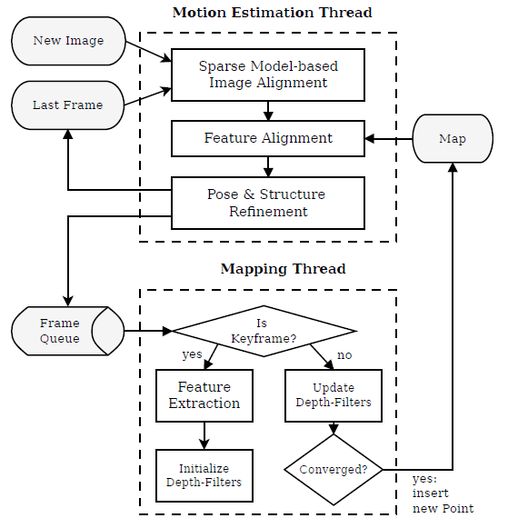
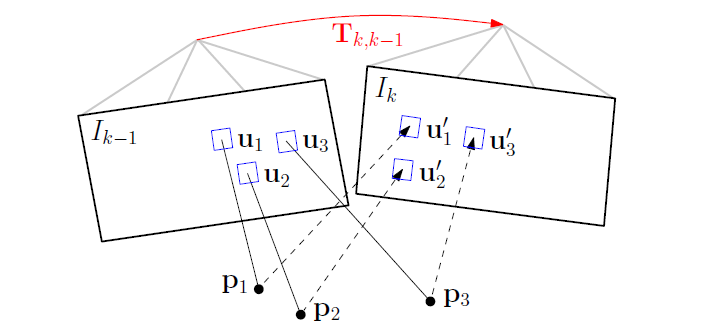

## SVO : Semi-Direct Visual Odometry

半直接视觉里程计，所谓的半直接是指对图像中提取的特征点图像块进行直接匹配来获取相机的位姿，而不同于直接匹配法那么对整个图像使用直接匹配的方式来获取相机位姿。虽然*半直接 (Semi-Direct)* 法使用了特征块，但它的基础思想还是类似于*直接法 (Direct method)* 来获取位姿信息，这点与*特征点法  (Feature-Based method)* 的提取额一组稀疏特征点，使用特征描述子匹配，通过对极约束来估计位姿是不一样的。然而，半直接法与直接法不同的是它利用了特征块匹配，通过再投影误差最小化来对直接法估计的位姿进行优化。

!!! tip  
    虽然 SVO 并不是一个标准的完整 SLAM ，它没有后端优化与回环检查，但是 SVO 的代码结构清晰易于理解，很适合作为第一个入门项目。

## SVO 算法架构

SVO 算法架构主要分成两个部分：位姿估计、深度估计。如下图所示

运动估计线程部分实现了相对姿态估计的半直接法。步骤如下：  

1. 通过基于稀疏的图像对齐进行姿态初始化：通过最小化对应于相同 3D 点投影位置的像素之间的光度误差，得到相对于前一帧的相机姿态
2. 通过对相应的 feature-patch 进行对齐，对重新投影点对应的 2D 坐标进行优化
3. 通过最小化前向特征对准步骤中引入的重投影误差来精炼姿态和空间特征点位置以得到运动估计的结果

深度估计部分，为每个待估计相应 3D 点的 2D 特征初始化概率深度滤波器。每当在图像中发现此时的 3D 到 2D 的特征对应少于设定阈值的时候，将选择新的关键帧提取特征点，进而初始化新的深度滤波器。这些滤波器的初始值具有很大的不确定性，在随后的每一帧中，深度估计都以贝叶斯方式更新。当深度滤波器的不确定性足够小时（即收敛），在地图中插入一个新的三维点，并立即用于运动估计。

### 运动估计

SVO 利用直接方法对相机的相对运动和特征对应进行了初步的估计，并以基于特征的非线性重投影误差最小化方法进行了优化。下面将详细介绍其中的每个步骤。

#### 基于稀疏模型的图像对齐

基于稀疏模型的图像对齐 (Sparse Model-based Image Alignment) 使用直接法最小化图像块重投影残缺来获取位姿。如下图所示：其中{==红色==}的 $\color{red}{T_{k, k-1}}$ 为相邻帧之间的位姿变换，即待优化变量。

这个过程的数学表达为求一个关于刚体运动最大似然估计 $T_{k, k-1}$ ，即可以通过求在两个连续的相机姿态之间亮度残差的最小化负对数似然函数来得到：

$$
\begin{align}
\mathrm{T}_{k,k-1} = \mathrm{arg\, \mathop{min}\limits_T} \iint_{\bar{\mathcal{R}}} \mathrm{\rho} [\delta I(\mathrm{T}, \mathbf{u})] \mathrm{d} \mathbf{u}
\end{align}
$$

因此这个过程可以分解为：

- **准备工作：**假设相邻帧之间的位姿 $\mathrm{T}_{k, k-1}$ 已知，一般初始化为上一相邻时刻的位姿或者假设为单位矩阵。通过之前多帧之间的特征检测以及深度估计，我们已经知道在第 k-1 帧中的特征点位置 $\mathbf{u}$ 以及它们的深度 $\mathrm{d}_\mathbf{u}$ 。 

- **重投影：**亮度残差 $\delta I$ 由观测同一个三维空间点的像素间的光度差确定。准备工作中已知了 $I_{k-1}$ 中的某个特征在图像平面中位置 $\mathbf{u}$ 以及它们的深度 $\mathrm{d}_\mathbf{u}$ ，能够将该特征投影到三维空间 $\mathrm{p}_{k-1}$ 。由于该三维空间的坐标系是定义在 $I_{k-1}$ 相机坐标系下的，因此需要通过位姿变换 $T_{k, k-1}$ 将它投影到当前帧 $I_{k}$ 中，得到该点当前帧坐标系中的三维坐标 $\mathrm{p}_{k}$ 。最后通过相机内参，投影到 $I_{k}$ 的图像平面得到坐标 $\mathbf{u}'$ ，完成重投影。亮度残差 $\delta I$ 定义为：

    $$
\begin{align}
\delta I (\mathrm{T}, \mathbf{u}) = I_k \Big( \underbrace{ \pi \big( \underbrace{ \mathrm{T} \cdot \underbrace{\pi^{-1}(\mathbf{u}, \mathrm{d}_\mathbf{u}) \big)}_{1}}_2 }_3 \Big) - I_{k-1}(\mathbf{u}) \quad \forall \mathbf{u} \in \bar{\mathcal{R}}
\end{align}
    $$

    公式中第 1 步为根据前一帧图像特征位置和深度逆投影到三维空间，第 2 步将三维坐标点旋转平移到当前帧坐标系下，第 3 步再将三维坐标点投影回当前帧图像坐标。其中上一帧 $I_{k-1}$ 和当前帧  $I_{k}$ 能共视到的特征集合为 $\bar{\mathcal{R}}$ ，即
    
    $$
\begin{align}
\bar{\mathcal{R}} = \{ \mathbf{u} | \mathbf{u} \in \mathcal{R}_{k-1} \wedge \pi (\mathrm{T} \cdot \pi^{-1}(\mathbf{u}, \mathrm{d}_\mathbf{u})) \in \Omega_k \}
\end{align}
    $$

    当然在优化过程中，亮度残差 $\delta I$ 的计算方式不止这一种形式：有**前向 (forwards)** ，**逆向 (inverse)** 之分，并且还有**叠加式 (additive)** 和**构造式 (compositional)** 之分。这方面可以读读光流法方面的论文，Baker 的大作[《Lucas-Kanade 20 Years On: A Unifying Framework》](https://www.cs.cmu.edu/afs/cs/academic/class/15385-s12/www/lec_slides/Baker&Matthews.pdf)。选择的方式不同，在迭代优化过程中计算雅克比矩阵的时候就有差别，一般为了减小计算量，都采用的是 **inverse compositional algorithm** 。 (#TODO 抑或是参考计算机视觉基础-光流篇) 

- **迭代优化更新位姿：**按理来说极短时间内的相邻两帧拍到空间中同一个点的亮度值应该没啥变化。但由于位姿是假设的一个值，所以重投影的点不准确，导致投影前后的亮度值是不相等的。不断优化位姿使得这些以特征点为中心的 $4 \times 4$ 像素块残差最小，就能得到优化后的位姿 $\mathrm{T}_{k, k-1}$ 。

将上述过程公式化如下：为简便起见，我们假设亮度残差服从单位方差正态分布，那么负对数最小化似然估计等同于最小二乘问题，即 $\rho[\cdot] \hat{=} \frac{1}{2} \|\cdot \| ^2$ 。因此位姿 $T_{k, k-1}$ 的最小化残差**损失函数 (Cost Function)** 为：

$$
\begin{align}
\mathrm{T}_{k,k-1} = \arg  \min_\limits{\mathrm{T}_{k,k-1}} \frac{1}{2} \sum_{i \in \bar{\mathcal{R}}} \| \delta \mathrm{I}(\mathrm{T}_{k,k-1}, \mathbf{u}_i \|^2
\end{align}
$$

上面的非线性最小化二乘问题，可以用高斯牛顿迭代法求解。设位姿变换的估计值为 $\hat{T}_{k, k-1}$ 、通过**旋转坐标 (twist coordinates)** $\xi = (\omega, \upsilon)^\top \in \mathfrak{se}(3)$ 参数化估计的增量更新 $\mathrm{T}(\xi)$ 。依据图像 $I_{k-1}$ 的计算更新 $\mathrm{T}(\xi)$ ，通过 **inverse compositional** 构造亮度残差：

$$
\begin{align}
\delta \mathrm{I}(\xi, \mathbf{u}_i) = \mathrm{I}_k \big(\pi(\hat{\mathrm{T}}_{k,k-1} \cdot \mathbf{p}_i) \big) - \mathrm{I}_k \big(\pi(\mathrm{T}(\xi) \cdot \mathbf{p}_i) \big)\, , \quad \mathbf{p}_i = \pi^{-1}(\mathbf{u}_i, \mathrm{d}\mathbf{u}_i)
\end{align}
$$

当前的估计值通过下式跟新，

$$
\begin{align}
\hat{\mathrm{T}}_{k,k-1} \gets \hat{\mathrm{T}}_{k,k-1} \cdot {\mathrm{T}}(\xi)^{-1}
\end{align}
$$

为了找到最佳的更新量 $\mathrm{T}(\xi)$ ，我们可以通过求式 (4) 的偏导数并让它等于零：

$$
\begin{align}
\sum_{i \in \hat{\mathcal{R}}} \triangledown \delta \mathrm{I} (\xi, \mathbf{u}_i)^\top \delta \mathrm{I}(\xi, \mathbf{u}_i) = 0
\end{align}
$$

为了求解上式，我们对当前状态进行线性化：

$$
\begin{align}
\delta \mathrm{I} (\xi, \mathbf{u}_i) \approx \delta \mathrm{I}(\xi, \mathbf{u}_i) = 0
\end{align}
$$

--8<--
mathjax.txt
--8<--